<p align="center">
  
</p>

<p align="center">
  <b>jpac は、日本の「住所」を横断的に紐づけるためのデータ群です。</b><br>
  国の機関が自ら公開しているデータだけから作っています。
</p>

---

## 概要

| | |
|---|---|
| 日本の「住所」を | デジタル庁が定める町字（「西新宿一丁目」までの単位）を、住所の基準として扱います |
| 横断的に紐づける | 郵便番号・市外局番・国土交通省コードとの対応を、どの方向からでも辿れます。郵便番号から住所へも、市外局番から郵便番号へも |
| データ群 | 1枚の表ではありません。28のテーブルからなり、対応と一緒にその根拠も保持します |

どこか1つの役所だけでは答えられない問いに答えるためのデータです。

- 郵便番号 → どの住所を覆うか
- 旧郵便番号 → 現行の郵便番号 → 住所 → 国土交通省コード
- 郵便番号 → 市外局番の候補 ／ 市外局番 → 番号区画 → 市区町村 → 郵便番号
- 国土交通省コード → 住所 → 代表点の緯度経度

[クイックスタート](#クイックスタート) ・ [列定義](#フラット表の列) ・ [例](#例) ・
[データ構成](#データ構成) ・ [キーと関係](#キーと関係) ・
[収録データと統計](#収録データと統計) ・ [元データ](#元データ) ・
[confidence と relation_type](#confidence-と-relation_type) ・ [クエリ例](#クエリ例) ・
[テーブル構成と ER 図](#テーブル構成と-er-図) ・ [ビルド](#ビルド) ・
[ライセンス](#ライセンス)

---

## クイックスタート

リリースデータは3つのファイルで、中身は同じです。1枚の表として集計するなら Parquet か CSV.gz、
テーブル間の関係を辿るなら SQLite を使ってください。入手は GitHub Release から
（[リリースデータ](#リリースデータ)）。

### 読み込み

```python
import polars as pl

x = pl.read_parquet("jp_address_crosswalk.parquet")   # 727,110行 × 43列
```

```python
import pandas as pd

# CSV から読む場合は dtype=str が必須。指定しないと 0640941 が 640941 になります
x = pd.read_csv("jp_address_crosswalk.csv.gz", dtype=str)
```

```bash
sqlite3 jp_address_crosswalk.sqlite
```

### 郵便番号から住所を引く

```python
x.filter(pl.col("postal_code") == "1600023").select(
    "pref_name", "city_name", "town_name", "machiaza_id", "mlit_code",
    "postal_confidence", "postal_status",
)
# 8行返ります（西新宿一丁目〜八丁目）。1行ではありません
```

```sql
SELECT pref_name, city_name, town_name, machiaza_id, mlit_code,
       postal_relation_type, postal_confidence, postal_status
FROM   address_crosswalk
WHERE  postal_code = '1600023';
```

住所から引く場合も同じ表で、`town_name` ではなく `machiaza_id` か `address_id` を条件に
してください。町名は全国で重複します（[町名は識別子にならない](#町名は識別子にならない)）。

### 曖昧な対応を除いて1件に絞る

`postal_status = 'auto'` は、候補が1件しかなく、公式のコード対応で確定した行だけを表します。

```python
confident = x.filter(pl.col("postal_status") == "auto")   # 674,578行
```

`LIMIT 1` や先頭行の採用は、複数ある正しい対応から任意の1件を選ぶことになります。絞るなら
順番ではなく根拠の列で絞ってください。曖昧な住所は結果に出ません。

### 列の読み方

列名は `<系統>_<項目>` です。系統は `postal_`（郵便番号）、`mlit_`（国土交通省）、
`telephone_`（市外局番）の3つで、それぞれ同じ8項目を持ちます。よく使うのは
`*_status`（`auto` なら自動で確定した対応）、`*_confidence`、`*_candidate_count` です。

43列すべての定義・型・NULL の割合・実際の値の分布は [フラット表の列](#フラット表の列)。

### SQLite のビュー

| ビュー | 中身 |
|---|---|
| `address_crosswalk` | 現在有効な対応のフラット表。通常はこれを使います |
| `address_crosswalk_all` | 人手で棄却された対応や過去の版も含む全量 |
| `unmatched_records` | 対応が付かなかったレコード（`kind` / `record_id` / `matching_rule_id`） |

前者2つは要確認（`review_required`）の行も含みます。除きたい場合は上記のとおり
`postal_status = 'auto'` で絞ってください。棄却も退役もまだ発生していないため、この版では
2つのビューの行数は同じ（727,110行）です。

そのまま実行できる SQL 12本と、結果の読み方は [`docs/queries/`](docs/queries/)。

---

## フラット表の列

Parquet と CSV.gz、SQLite のビュー `address_crosswalk` は、いずれも同じ43列の1枚の表です。
ほとんどの用途はこの表だけで済みます。以下はその全列の定義で、数値は
`v1.0.0+data-2026-08-23`（727,110行）の実測値です。

### 1行が表すもの

1行は **1つの住所 × 対応する郵便番号 × 対応する国土交通省レコード** の組み合わせです。
住所726,170件に対して727,110行あるのは、対応が複数ある住所がその数だけ行に展開される
ためです（複数行になるのは591件、最多で40行）。対応が見つからなかった住所も必ず1行は
出ます。その場合、相手側の列が NULL になります。

**この表に一意キーはありません。** `address_id` は重複します。`(address_id, postal_code)`
でも4件だけ重複が残ります（国土交通省が同じコードに複数の代表点を持つ場合）。住所の件数を
数えるときは行数ではなく `address_id` の異なり数を使ってください。

```python
x.height                      # 727,110（行数）
x["address_id"].n_unique()    # 726,170（住所の件数）
```

### 住所（9列）

デジタル庁の町字マスター由来。全行に必ず入ります（`ward_name` を除く）。

| 列 | 型 | NULL | 例 | 内容 |
|---|---|---:|---|---|
| `address_id` | 文字列 | 0% | `jpa1dy9jn5hy738r9wnb` | 住所の永続 ID。20文字。行は重複しますが、住所の識別子はこれだけです |
| `lg_code` | 文字列 | 0% | `131041` | デジタル庁の市区町村コード6桁 |
| `jis_city_code` | 文字列 | 0% | `13104` | JIS 市区町村コード5桁。`lg_code` の先頭5桁と常に一致します |
| `pref_name` | 文字列 | 0% | `東京都` | 都道府県名。47種 |
| `city_name` | 文字列 | 0% | `新宿区` | 市区町村名。1,709種 |
| `ward_name` | 文字列 | 92.0% | `中央区` | 政令指定都市の行政区名。該当しない行は NULL |
| `town_name` | 文字列 | 0% | `西新宿一丁目` | 町字名。**ABR の表記のまま**で、「一丁目」と「２丁目」の混在もそのままです |
| `town_name_normalized` | 文字列 | 0% | `西新宿1丁目` | 照合に使った正規化後の表記。表記ゆれを跨いで突き合わせるときはこちら |
| `machiaza_id` | 文字列 | 0% | `0023001` | ABR の町字ID 7桁。**全国では一意ではありません**（異なり数 80,825）。一意になるのは `(lg_code, machiaza_id)` の組です |

### 郵便番号（10列）

| 列 | 型 | NULL | 例 | 内容 |
|---|---|---:|---|---|
| `postal_code` | 文字列 | 7.0% | `1600023` | 現行の郵便番号7桁。NULL は日本郵便側に対応が無い住所（51,009行） |
| `old_postal_code` | 文字列 | 7.0% | `02304` | 1998年以前の3桁または5桁。**複数ある場合は `;` 区切り**（例 `93021;93923`、186行） |
| `postal_relation_type` | 文字列 | 7.0% | `equivalent` | この表の郵便番号はデジタル庁の公式変換表由来のみなので、値は `equivalent` だけです |
| `postal_match_method` | 文字列 | 7.0% | `direct_code` | 対応の取り方。同上の理由で `direct_code` だけ |
| `postal_rule` | 文字列 | 7.0% | `P1` | 適用された照合規則。同上の理由で `P1` だけ |
| `postal_confidence` | 実数 | 7.0% | `0.99` | 公式のコード対応であることを表す値。確率ではありません |
| `postal_candidate_count` | 整数 | 7.0% | `1` | 候補の件数。1 が 674,578行、2以上が 1,523行（最大19） |
| `postal_candidate_group` | 文字列 | 99.8% | `grp_2d33f62b…` | 候補が2件以上のときだけ入る、同じ候補群を束ねる ID |
| `postal_is_unique` | 真偽 | 7.0% | `true` | 候補が1件に定まったか |
| `postal_status` | 文字列 | 7.0% | `auto` | `auto` 674,578行 ／ `review_required` 1,523行 |

名称照合で作ったもう1本の住所↔郵便番号の対応は、この表には入りません。信頼度の違うものを
同じ列に混ぜないためです。必要なら SQLite の `bridge_address_postal` を直接引いてください。

### 国土交通省（11列）

| 列 | 型 | NULL | 例 | 内容 |
|---|---|---:|---|---|
| `mlit_code` | 文字列 | 74.7% | `131040023001` | 大字・町丁目コード12桁 |
| `mlit_latitude` | 実数 | 74.7% | `35.690383` | 代表点の緯度。20.43〜45.51 |
| `mlit_longitude` | 実数 | 74.7% | `139.697501` | 代表点の経度。122.99〜146.33 |
| `mlit_relation_type` | 文字列 | 0% | `exact` | `exact` 168,390 ／ `equivalent` 15,722 ／ `ambiguous` 106 ／ `unresolved` 542,892 |
| `mlit_match_method` | 文字列 | 0% | `composite` | `composite` ／ `direct_code` ／ `normalized_name` ／ `unresolved` |
| `mlit_rule` | 文字列 | 0% | `M1` | `M1` 162,861 ／ `M2` 15,722 ／ `M3` 5,529 ／ `M4` 106 ／ `M5`（未対応）542,892 |
| `mlit_confidence` | 実数 | 0% | `1.0` | 0.0〜1.0。未対応の行は 0.0 |
| `mlit_candidate_count` | 整数 | 0% | `1` | 0 が 542,892行、1 が 184,112行、2 が 106行 |
| `mlit_candidate_group` | 文字列 | 100.0% | `grp_dfb194ef…` | 候補が2件以上のときだけ（106行） |
| `mlit_is_unique` | 真偽 | 0% | `true` | 候補が1件に定まったか |
| `mlit_status` | 文字列 | 0% | `auto` | `auto` 162,861行 ／ `review_required` 564,249行 |

対応率が低いのは欠損ではなく粒度の違いです。国土交通省側から見れば96%が繋がっています
（[到達率](#到達率)）。

### 市外局番（13列）

**この13列は現在すべて空です。** 総務省が町ごとの対応を公表していないため、意図的に埋めて
いません。市区町村単位で引く方法は [クエリ例](#クエリ例) にあります。

| 列 | 型 | 現在の値 | 内容 |
|---|---|---|---|
| `area_code` | 文字列 | 全行 NULL | 市外局番 |
| `numbering_area_code` | 文字列 | 全行 NULL | 番号区画コード |
| `numbering_area_name` | 文字列 | 全行 NULL | 番号区画名 |
| `telephone_derivation` | 文字列 | 全行 NULL | 対応の導出経路 |
| `telephone_relation_type` | 文字列 | `unresolved` | |
| `telephone_match_method` | 文字列 | `unresolved` | |
| `telephone_rule` | 文字列 | `T10` | 町単位では対応を作らない、という規則そのもの |
| `telephone_confidence` | 実数 | `0.0` | |
| `telephone_candidate_count` | 整数 | `0` | |
| `telephone_candidate_group` | 文字列 | 全行 NULL | |
| `telephone_is_unique` | 真偽 | `false` | |
| `telephone_status` | 文字列 | `review_required` | |
| `telephone_coverage_type` | 文字列 | `municipality_only` | 公表されているのが市区町村までであることを示します |

### 根拠列は3系統で同じ形

`postal_` ／ `mlit_` ／ `telephone_` の3系統は、いずれも同じ8項目を持ちます。系統をまたいだ
処理を書くときは接頭辞を差し替えるだけで済みます。

| 接尾辞 | 意味 |
|---|---|
| `_relation_type` | 対応の付き方（`exact` / `equivalent` / `parent` / `child` / `overlap` / `ambiguous` / `unresolved`） |
| `_match_method` | どうやって対応を見つけたか |
| `_rule` | 適用された照合規則の ID |
| `_confidence` | 確からしさ 0〜1。**確率ではありません** |
| `_candidate_count` | 候補の件数。2以上なら1件に決まっていません |
| `_candidate_group` | 候補が2件以上のときだけ入るグループ ID |
| `_is_unique` | 候補が1件に定まったか |
| `_status` | `auto`（自動確定）／ `review_required`（要確認）／ NULL（対応なし） |

値の意味は [confidence と relation_type](#confidence-と-relation_type)、規則の全文は
[`docs/MATCHING_RULES.md`](docs/MATCHING_RULES.md)。

### NULL の3つの意味

同じ NULL でも、読み方は3通りあります。

1. **対応が見つからなかった** — `postal_code` や `mlit_code` の NULL。行は削除せず残して
   あるので、「探したが無かった」という記録です。
2. **その行には該当しない** — `ward_name` の NULL。政令指定都市の行政区でないだけです。
3. **その情報が不要** — `*_candidate_group` の NULL。候補が1件なら群を作る必要がありません。

`*_relation_type` が `unresolved` の行は 1 に当たります。`*_status` が NULL のときは、
その系統の対応表にその住所の行自体が無いことを意味します。

### 型について

`address_id` / `lg_code` / `jis_city_code` / `machiaza_id` / `postal_code` /
`old_postal_code` / `mlit_code` / `area_code` / `numbering_area_code` は**すべて文字列**です。
Parquet と SQLite は型を保持しますが、CSV を数値として読み込むと `0230401` が `230401` に
なります。pandas なら `dtype=str`、polars なら `infer_schema_length=0` を付けてください。

数値なのは `*_confidence`（実数）、`*_candidate_count`（整数）、`mlit_latitude` /
`mlit_longitude`（実数）、真偽値の `*_is_unique` だけです。

---

## 例

以下はすべて実際のビルド結果です。

### 郵便番号 1600023 は8件の住所に対応する

| 住所 | 郵便番号 | 国土交通省コード | jpac の ID |
|---|---|---|---|
| 東京都新宿区西新宿一丁目 | 1600023 | 131040023001 | `jpa1dy9jn5hy738r9wnb` |
| 東京都新宿区西新宿２丁目 | 1600023 | 131040023002 | `jpa1d3c2z1tmnb0bnkcr` |
| 東京都新宿区西新宿３丁目 | 1600023 | 131040023003 | `jpa11p02cf9zmvg3f57r` |
| …（四〜七丁目も同じ） | | | |
| 東京都新宿区西新宿８丁目 | 1600023 | 131040023008 | `jpa1tgdzg4wsmchae4e0` |

郵便番号 `1600023` は西新宿の一丁目から八丁目までをまとめて表す番号です。1つの郵便番号が
1つの住所を指すとは限らないため、jpac は8件すべてを根拠の列とともに返します。

最も多いのは山口県長門市の `7594401` で、614件の住所を覆っています。小字が細かく分かれて
いる地域に、郵便番号が広めに割り当てられているためです。

### 小山市には市外局番が4つある

| 市区町村 | 市外局番 |
|---|---|
| 栃木県小山市 | `0285` ／ `0280` ／ `0282` ／ `0296` |

市外局番の区切りは市区町村の区切りと一致せず、1つの市が複数の市外局番にまたがることが
あります。3つ以上にまたがる市区町村は17あり、京都市・西宮市・新潟市・高山市・萩市・
東広島市などが含まれます。

総務省が公表しているのは「この区画はこの市区町村を含む」までで、どの町がどちらの局番かは
公表していません。したがって jpac も市外局番は市区町村までしか付けておらず、町ごとの
市外局番の欄は NULL のままにしてあります。推測で埋めると、公式が述べていないことを
述べたことになるためです。

### 旧郵便番号 160 は現行の60件に分かれる

1998年に郵便番号が3桁・5桁から7桁になったとき、1つの旧番号は複数の新番号に分かれました。

| 旧郵便番号 | 現行の郵便番号 | 住所 |
|---|---|---|
| 160 | 1600001 | 東京都新宿区片町 |
| 160 | 1600005 | 東京都新宿区愛住町 |
| 160 | 1600016 | 東京都新宿区信濃町 |
| 160 | 1600018 | 東京都新宿区須賀町 |
| …（全部で60個） | | |

古い名簿や台帳を現在のデータと突き合わせる際に必要になる対応です。

---

## 背景

日本の「住所」は1つの役所が管理しているわけではなく、少なくとも4つの体系が別々の役所に
よって、別々の目的で並行して運用されています。

| 誰が | 何を | 目的 |
|---|---|---|
| デジタル庁 | 住所そのもの（町字） | 行政の基盤情報 |
| 日本郵便 | 郵便番号（現行7桁・旧3/5桁） | 郵便物の区分 |
| 国土交通省 | 大字・町丁目コードと代表点の緯度経度 | 位置の参照 |
| 総務省 | 市外局番と番号区画 | 電話番号の割り当て |

それぞれ自分の体系については正確ですが、互いの対応表はどこも公開していません。目的が違う
ため、区切り方も更新の時期も一致しません。市外局番の区切りは市区町村の区切りとすら一致
しません。

## 対象外

- 地図の座標を出すものではありません。国土交通省の緯度経度は町全体の代表点であり、建物の
  位置ではないため、配送や経路探索には使えません。
- 番地・号は扱いません。粒度は「西新宿一丁目」までで、「1-2-3」は入っていません。
- Web サービスではありません。ダウンロードして使うファイルです。
- すべての住所に対応先があるわけではありません。対応が見つからなかったものは、埋めずに
  `unresolved` として残しています。

対象外の一覧と、V1 で分かっている制約は [`docs/LIMITATIONS.md`](docs/LIMITATIONS.md)。

---

## データ構成

1枚の対応表ではなく、中心に1本の基準となる住所があり、そこから他の体系へ対応表が伸びる
構造です。この対応表を以降ブリッジと呼びます。



<sub>図の出典: [`docs/diagrams/01-data-overview.mmd`](docs/diagrams/01-data-overview.mmd)</sub>

- 基準となる住所 — デジタル庁の町字マスター。住所の名前と範囲は常にこれを基準にします。
- 各制度の記録 — 郵便番号、国土交通省コード、市外局番。元のまま保存し、対応を取りやすく
  するための書き換えはしません。役所どうしで表記が食い違う場合は、その食い違いをそのまま
  残し、食い違っているという事実をブリッジに記録します。
- ブリッジ — 「AとBが対応する」という関係だけを、根拠と確からしさ付きで保持します。
  対応しなかったという事実もここに残ります。

ブリッジは6本です。住所↔郵便番号（2種類）、住所↔国土交通省コード、住所↔市外局番、
市区町村↔郵便番号、市区町村↔市外局番。

住所と郵便番号のブリッジが2本あるのは、デジタル庁が公式に出している変換表による対応と、
日本郵便のファイルを名前で突き合わせて作った対応を、混ぜずに分けて保存しているためです。
前者は公式が明示した対応、後者は照合結果であり、信頼度が異なります。

---

## キーと関係

### キー

| キー | 内容 | 例 | 発番元 |
|---|---|---|---|
| `address_id` | 住所1件ごとの永続 ID。jpac で唯一の主キー | `jpa1dy9jn5hy738r9wnb` | jpac |
| `lg_code` | 市区町村の番号（6桁） | `131041` = 新宿区 | デジタル庁 |
| `postal_code` | 郵便番号（7桁） | `1600023` | 日本郵便 |
| `mlit_code` | 国土交通省の大字・町丁目コード（12桁） | `131040023001` | 国土交通省 |
| `numbering_area_code` | 番号区画。市外局番はここにぶら下がる | `219` → 市外局番 `03` | 総務省 |

いずれも数字に見えますが型は文字列です。Excel や pandas で数値として読み込むと `0123` の
先頭の `0` が落ちて別の番号になります。

### 町名は識別子にならない

「西新宿」という町は、東京都新宿区のほかに埼玉県蓮田市と兵庫県佐用町にもあります。同名の町
は全国に多数あるため、名前で名寄せをすると混ざります。一意なのは `address_id` だけです。

### 関係の多重度

| 何と何 | 関係 | 意味 |
|---|---|---|
| 住所 → 市区町村 | 多対一 | 1つの市区町村に多数の住所 |
| 住所 ↔ 郵便番号 | 多対多 | 1つの郵便番号が複数の住所を覆い、逆もある |
| 住所 ↔ 国土交通省コード | 多対多 | 粒度が完全には一致しない |
| 市区町村 ↔ 市外局番 | 多対多 | 前述の小山市のとおり |
| すべての行 → 取得元の記録 | 多対一 | どのファイルのどの版から来たかが必ず分かる |

多対多の関係はすべてブリッジを経由します。住所のテーブルに郵便番号の列を持たせる構造には
していません。1対1でないものを1対1の形に押し込めないためです。

### 主キーに公的コードを使わない理由

デジタル庁は町字の番号にも市区町村の番号にも訂正を出します。市町村合併が起きれば、町自体は
存続していても市区町村の番号が変わり、政令指定都市になれば区が入って振り直しになります。
公的コードをそのまま主キーにすると、そのたびに、それを保存していた利用者側のデータが黙って
壊れます。

このため jpac は独立した `address_id` を発番し、台帳で追跡しています。



<sub>図の出典: [`docs/diagrams/06-identity.mmd`](docs/diagrams/06-identity.mmd)</sub>

### address_id の付け方

`jpa1dy9jn5hy738r9wnb` のような20文字で、内訳は方式を表す `jpa1` と、16文字のペイロード
です。ペイロードの文字種は Crockford base32（`0-9` と `I`・`L`・`O`・`U` を除いた英小文字）
で、読み違えや書き写しの誤りが起きにくい集合になっています。

**初回の発番。** 最初に観測したときの自然キーからハッシュで作ります。

```
key    = "abr:town:" + lg_code + ":" + machiaza_id      例) abr:town:131041:0023001
digest = BLAKE2s(key, 10 バイト)
id     = "jpa1" + digest を base32 で 16 文字に
```

ハッシュなので決定的です。状態のないところから同じ元データでビルドし直せば、同じ
`address_id` が再現されます。同時に不透明でもあります。ID から市区町村を読み取れないの
は意図的で、読み取れてしまうと合併後にその読み取りが間違いになるからです。

キーに使うのは、最初に観測したときのコードです（genesis キー）。その後コードが訂正されて
も ID は作り直しません。台帳
[`identity/address_id_ledger.csv.gz`](identity/address_id_ledger.csv.gz)（現在 726,170 行）
が、genesis キーと現在のキーの両方を1行ずつ保持しています。

**2回目以降のビルド。** 台帳の各行と、今回の元データの各行を突き合わせます。評価順は
`I1` → `I6` → `I2` → `I3` に固定されていて、最初に成立したものが採用されます。どれも成立
しなければ `I5` です。順序が固定なので、行の並び順で結果が変わることはありません。

| 規則 | 成立条件 | 結果 |
|---|---|---|
| `I1` | 有効な台帳行とキー（`lg_code` + `machiaza_id`）が完全一致 | 同じ `address_id` を継続 |
| `I4` | `I1` に加えて町名が変わっている | 同じ ID を継続し、改称として `address_lineage` に記録 |
| `I2` | 同一市区町村内で `machiaza_id` が訂正された。町名が一致し、その候補の旧キーが今回の元データから消えており、候補がちょうど1件 | 同じ ID を引き継ぐ |
| `I3` | 市区町村コードが変わった。`machiaza_id` と町名が一致し、その `lg_code` の遷移が [`overrides/municipality_lineage.yml`](overrides/municipality_lineage.yml) に登録されていて、候補がちょうど1件 | 同じ ID を引き継ぐ |
| `I5` | 上のいずれにも当たらない、または候補が2件以上 | 新しい ID を発番する（候補が2件以上あった場合は、その候補をレビュー項目に残す） |
| `I6` | 退役済みの行とキーが一致 | 自動では復活させない。新しい ID を発番し、レビュー項目に回す |

`I2` と `I3` が「候補がちょうど1件」を求めるのは、同名の町が全国にあるためです。候補が複数
あるときに1つ選ぶと、別の町の ID を継承させることになります。候補が絞れないときは新しい ID
を発番します。誤った引き継ぎより、ID が1つ増える方がましだからです。

`I3` が人手の登録簿を必要とするのも同じ理由です。「A市がB市に合併した」という市区町村単位の
事実は、「A市の○○町とB市の○○町が同じ町である」という町単位の証拠ではありません。

**キーの再利用と退役。** デジタル庁が一度廃止した `machiaza_id` を別の町に振り直した場合、
同じキーをハッシュすると退役した ID と同じ値になります。そこで台帳が既に知っている ID に
当たった場合は、キーに世代（`#g1`, `#g2`, …）を足して別の ID を発番します。それでも衝突が
解消しなければ `IDENTITY_COLLISION` でビルドを停止します。

逆に、元データから消えた行は削除しません。`entity_status` を `retired` にして台帳に残し、
`address_lineage` に退役として記録します。

> V1 には制約があります。`address_id` はコードの訂正や町名の変更を越えて維持されますが、
> 市町村合併で市区町村コードが変わった場合の引き継ぎ（`I3`）は動きません。上記の登録簿を
> V1 では空のまま出荷しているためです。合併が起きた町は、古い ID が退役し新しい ID が
> 振られます（[`docs/LIMITATIONS.md`](docs/LIMITATIONS.md) の項目11）。

規則の全文と設計上の根拠は [`docs/IDENTITY_MODEL.md`](docs/IDENTITY_MODEL.md)、実装は
[`src/jp_address_crosswalk/identity.py`](src/jp_address_crosswalk/identity.py)。


---

## 収録データと統計

> 以下はすべて `v1.0.0+data-2026-08-23` の実測値です（ビルド日時 2026-08-23T11:53:50Z ／
> 照合規則版 1.3.0 ／ 品質チェック123項目すべて合格）。数値は版が変わると変わります。
> 最新値はリリースデータに同梱される `QUALITY_REPORT.md` にあります。

約72万件の住所を中心に、12万件の郵便番号、19万件の国土交通省コード、582件の番号区画を
繋いでいます。市区町村は1,918。

### 住所

| テーブル | 件数 | 中身 |
|---|---:|---|
| `address` | 726,170 | 現在有効な住所（町字）。デジタル庁の町字マスター由来 |
| `address_entity` | 726,170 | 住所の ID 台帳。一度でも観測した住所が1件1行。削除しない |
| `address_code` | 2,178,510 | その住所が過去に持っていたコードの履歴（追記のみ） |
| `address_rsdt_variant` | 727,418 | 住居表示のバリアント |
| `municipality` | 1,918 | 市区町村 |
| `municipality_version` | 1,918 | 市区町村の版（名前が変わったら上書きせず追加） |
| `address_history` | 0 | 属性が変わった記録 |
| `address_lineage` | 0 | 分割・統合・改称・退役の記録 |
| `address_key_conflict` | 0 | 元データのキーが衝突した記録 |

末尾3本が0件なのは欠損ではなく、これが最初のリリースで、まだ変更事象が1度も起きていない
ためです。

### 各制度のデータ

元のまま保存しているものです。

| テーブル | 件数 | 中身 |
|---|---:|---|
| `postal_code_entity` | 120,682 | 7桁の郵便番号そのもの |
| `postal_record` / `postal_record_version` | 124,513 | 日本郵便のファイルの1行 = 1件。旧郵便番号もここ |
| `mlit_town` / `mlit_town_version` | 191,106 | 国土交通省の大字・町丁目。代表点の緯度経度つき |
| `telephone_area` / `telephone_area_version` | 582 | 番号区画 |
| `telephone_area_coverage` | 1,629 | 「この区画はどの市区町村を含むか」の公式文を1文ずつ構造化 |
| `telephone_number_block` | 41,987 | 市内局番の割り当て |

日本郵便のファイルには住所ではない特殊なレコードが混ざります。内訳は通常の町字 122,603 件、
「以下に掲載がない場合」1,870 件、「〜一円」23 件、「〜の次に番地がくる場合」17 件。
「以下に掲載がない場合」は特定の町ではなく、その市区町村のうち個別の郵便番号が振られて
いない部分をまとめて表す行です。通常の住所として扱うと対応が壊れるため、市区町村レベルの
対応表に振り分けています。

### ブリッジ

| ブリッジ | 行数 | 対応がついた割合 | 自動確定 |
|---|---:|---:|---:|
| 住所 ↔ 郵便番号（公式の変換表） | 676,124 | 99.996% | 674,574 |
| 住所 ↔ 郵便番号（名称照合） | 352,499 | 78.86% | 0 |
| 住所 ↔ 国土交通省コード | 733,948 | 24.99% | 162,057 |
| 住所 ↔ 市外局番 | 726,170 | 0%（全件が意図的に空） | 0 |
| 市区町村 ↔ 郵便番号 | 10,117 | 100% | 0 |
| 市区町村 ↔ 市外局番 | 2,189 | 100%（うち候補どまり 1.051%） | 0 |

来歴の記録として `source_snapshot` 66 件（取得したファイル1本 = 1行。URL・SHA-256・規約・
行数）、`match_run` 1 件、`match_run_input` 64 件。合計28テーブル。

### 到達率

| 繋がり先 | 到達率 | 読み方 |
|---|---:|---|
| 郵便番号 | 93.0% | 675,161 / 726,170 件。うち 674,574 は自動で確定、587 は要確認 |
| 国土交通省 | 25.3% | 低いのは欠損ではなく粒度の違い。国土交通省側から見れば 183,332 / 191,106 = 96% が繋がっている |
| 市外局番 | 99.7% | 市区町村単位で 1,912 / 1,918。未達は北方領土の6件のみ |

繋がらなかったレコードも保持しています。住所 542,792 件、郵便レコード 25,647 件、
国土交通省 7,774 件。

### ファイルサイズ

Parquet 35.2 MB ／ CSV.gz 41.3 MB ／ SQLite 1.81 GiB ／ テーブル別 Parquet 28本。
1枚にまとめた表（Flat View）は 727,110行 × 43列です。1つの郵便番号が複数行になるため、
行数は住所の件数より多くなります。

---

## 元データ

| 発行元 | データセット | 役割 | 更新の目安 |
|---|---|---|---|
| デジタル庁 | 全国 町字マスター | 基準となる住所 | 不定期 |
| デジタル庁 | ABR町字・郵便番号変換表 | 公式の住所↔郵便番号対応 | 不定期 |
| デジタル庁 | 全国 市区町村マスター | 市区町村 | 不定期 |
| 日本郵便 | 住所の郵便番号（UTF-8） | 郵便番号 + 旧郵便番号 | 月次（月末） |
| 国土交通省 | 位置参照情報 大字・町丁目レベル | コード + 代表点の緯度経度 | 年1回（年度単位） |
| 総務省 | 市外局番の一覧 | 番号区画 ↔ 市外局番 ↔ 対象地域 | 不定期 |
| 総務省 | 電気通信番号指定状況（固定電話等） | 市内局番の割り当て | 年1回 |

日本郵便の月次差分ファイル（追加・廃止）は受け入れて来歴に記録していますが、V1 では
テーブルに取り込んでいません。変更履歴として扱うには連続した月数の観測が必要なためです。

> 更新の目安は発行元の公表に基づくもので、jpac に記録された版情報ではありません。元データは
> 発行元ごとに更新周期がばらばらで、毎月ビルドしても実際に中身が動くのは基本的に郵便番号
> だけです。

すべて発行元から直接取得したものです。第三者やコミュニティが再加工した住所データは、入力
としても、照合の答え合わせとしても使っていません。

> 取得の仕組みはこのリポジトリには含まれません。探索・ダウンロード・規約の再確認・受け入れ
> は内部で管理しており、公開しているのは受け入れ済みのデータを読む側だけです。各ファイルの
> 取得元 URL・SHA-256・規約は `dist/SOURCES.yml` と `source_snapshot` テーブルに記録されます。

---

## confidence と relation_type

すべての行が `confidence` を持ちます。これは確率ではありません。0.99 は「99% の確率で
正しい」ではなく、「発行元が公式に出したコード対応である」という意味です。どの根拠で対応が
付いたかを数値で表しただけなので、平均を取ったり掛け合わせたりしても意味を持ちません。

| 値 | 根拠 |
|---|---|
| 1.00 | 発行元がコードで明示し、かつ別の項目もそれを裏づけている |
| 0.99 | この目的のために公開された、公式のコード対応 |
| 0.97 | 名前が一致し、双方向で1つに定まった |
| 0.95 | 公式の市区町村名リストの中で、ヶ/ケ の揺れを畳んで一意に定まった |
| 0.90 | 発行元が述べた構造的な親子関係／根拠つきの人手判断 |
| 0.70 | 市区町村までしか書かれていない |
| 0.50 以下 | 候補どまり。これだけでは確定しない |

対応の付き方（`relation_type`）も全行が持ちます。

| 値 | 意味 |
|---|---|
| `exact` | 同じ範囲。コードでも名前でも確認できた |
| `equivalent` | 公式のコード対応が「同じ」と述べている。名前までは独立に確認していない |
| `parent` / `child` | 一方がもう一方を含む／含まれる |
| `overlap` | 範囲が重なるが、どちらも相手を含みきらない |
| `ambiguous` | 候補が複数あり、どれか1つに決める根拠がない |
| `unresolved` | 対応先が見つからなかった。行は削除せず残してある |

スキーマの `CHECK` には `contains` と `candidate` も含まれますが、この版では0行です。

### 表記を統一しない範囲

jpac は全角英数の半角化や、丁目の漢数字→算用数字といった変換はしますが、ヶ/ケ/が、
ノ/之/の、旧字体と新字体、高/髙、崎/﨑、カタカナとひらがなは統一しません。日本の地名では
これらの違いが意味を持つことがあり、統一していたら消えていた省庁間の実在する表記差が実際に
検出されているためです。

規則の全体は [`docs/MATCHING_RULES.md`](docs/MATCHING_RULES.md)、結果の読み方は
[`docs/queries/`](docs/queries/)。

---

## リリースデータ

リリースデータは GitHub Release で配布します。リポジトリをクローンしても入りません
（元データもリリースデータもバージョン管理に含めていないため）。Release のアセットを直接
ダウンロードしてください。

| ファイル | 中身 | 用途 |
|---|---|---|
| `jp_address_crosswalk.parquet` | 1枚にまとめた表（727,110行 × 43列） | polars / pandas / DuckDB |
| `jp_address_crosswalk.sqlite` | テーブル28本 + ビュー3本 + 索引22本 | SQL で関係をたどる |
| `jp_address_crosswalk.csv.gz` | 1枚にまとめた表 | 汎用・アーカイブ |
| `QUALITY_REPORT.md` | そのビルドの全統計とチェック結果 | 数値の裏取り |
| `DIFF_REPORT.md` | 前回リリースからの変化 | 更新時の影響確認 |
| `NOTICE.md` / `SOURCES.yml` | 出典表示と、使用した各ファイルの URL・SHA-256・規約 | 再配布・引用時 |
| `SHA256SUMS` | リリースする全ファイルのハッシュ | 改ざん・破損の検証 |

2つのレポートは機械可読な `quality_report.json` / `diff_report.json` も併せて添付されます。

```bash
sha256sum -c SHA256SUMS
```

リリースのタグはコード版とデータ版を併記します（`v1.0.0+data-2026-08-23`）。同じコードでも
元データの版が違えば中身は変わるため、利用時は**タグ全体**を記録してください。

品質ゲートを通過したビルドだけがリリースされます。スキーマ変更・ライセンス変更・行数異常
などが1つでもあればリリースは作られません（[停止条件](#停止条件)）。

---

## クエリ例

どの例も根拠の列を一緒に返します。曖昧さを隠すための `LIMIT 1` は使いません。

```python
import polars as pl

x = pl.read_parquet("jp_address_crosswalk.parquet")

# 自動で確定した対応だけを取り出す（曖昧なものは返さない）
confident = x.filter(
    pl.col("postal_relation_type").is_in(["exact", "equivalent"])
    & (pl.col("postal_status") == "auto")
)
```

```sql
-- 郵便番号 -> 住所
-- (docs/queries/01_postal_to_address.sql)
.parameter set :postal_code '1600023'
SELECT town_name, machiaza_id,
       postal_relation_type, postal_rule, postal_confidence,
       postal_candidate_count, postal_status
FROM   address_crosswalk
WHERE  postal_code = :postal_code
ORDER  BY town_name;
```

```sql
-- 郵便番号 -> 市区町村レベルの市外局番候補
-- (docs/queries/04_postal_to_area_code.sql)
-- 総務省は町ごとの対応を公表していないため、これは意図的に市区町村の対応です
.parameter set :postal_code '0640941'
SELECT DISTINCT x.postal_code, t.area_code,
       b.target_id AS numbering_area_code,
       b.relation_type, b.coverage_type, b.confidence
FROM   address_crosswalk x
JOIN   bridge_municipality_telephone b ON b.lg_code = x.lg_code
JOIN   telephone_area_version t
       ON t.numbering_area_code = b.target_id AND t.is_current = 1
WHERE  x.postal_code = :postal_code
ORDER  BY t.area_code;
```

実行は `sqlite3 jp_address_crosswalk.sqlite < docs/queries/01_postal_to_address.sql`。
旧郵便番号の追跡を含む残り10本は [`docs/queries/`](docs/queries/) に索引つきで置いてあり、
市外局番の扱いや対応が付かなかったレコードの読み方も同じ場所にまとめてあります。

---

## テーブル構成と ER 図



<sub>図の出典: [`docs/diagrams/04-er.mmd`](docs/diagrams/04-er.mmd)</sub>

多くの実体は実体の表と版の表（`*_version`）に分かれています。名前や区域の記述が変わった
とき、上書きせずに新しい版を足すためです。前の版は `is_current = 0` を立ててそのまま残り
ます。実体の表は ID だけを持つ薄い表で、属性は版の表にあります（例：`municipality` は3列、
`municipality_version` は21列）。

ブリッジ6本はすべて同じ30列で、違うのは `target_id` が何を指すかだけです。

| ブリッジ | 起点 | `target_id` の中身 | 規則 |
|---|---|---|---|
| `bridge_address_postal_code` | `address_id` | 郵便番号7桁 | P1–P7 |
| `bridge_address_postal` | `address_id` | `postal_record_id`（日本郵便のファイルの1行） | P4–P7 |
| `bridge_address_mlit` | `address_id` | `mlit_record_id` | M1–M5 |
| `bridge_address_telephone` | `address_id` | 番号区画（現在は全件 NULL） | T10 |
| `bridge_municipality_postal` | `lg_code` | 郵便番号 | P5–P6 |
| `bridge_municipality_telephone` | `lg_code` | 番号区画 | T1–T10 |

### テーブル定義（DDL）

出荷されている SQLite の定義そのものを [`docs/schema.sql`](docs/schema.sql) に置いてあります。
手書きではなく、リリースデータから抽出して改行だけを入れたものです（テーブル28・ビュー3・索引22）。
読む前に押さえておく点が4つあります。

**1. 型はほぼ全部 `TEXT` です。**

```sql
CREATE TABLE "municipality" (
  "lg_code"                    TEXT PRIMARY KEY,
  "jis_city_code"              TEXT,
  "first_observed_snapshot_id" TEXT
);
```

`lg_code` は `013100` のように先頭がゼロになります。数値型にすると `13100` になるため、
コードは一切数値にしません。数値なのは `confidence`（REAL）と、候補数・フラグ類（INTEGER）
だけです。

**2. 外部キー制約は宣言されていません。** `REFERENCES` も `FOREIGN KEY` も1つもありません。
[関係の多重度](#関係の多重度)で示した参照関係は論理的なもので、整合性はビルド時の不変条件
テストで担保しています（[`docs/TEST_STRATEGY.md`](docs/TEST_STRATEGY.md) §3）。外部キーが
効いている前提で `PRAGMA foreign_keys` に頼らないでください。

**3. 4つのテーブルには `PRIMARY KEY` がありません。** `address_code` /
`address_key_conflict` / `match_run_input` / `snapshot_license_artifact` の4本です。
[`docs/DATA_MODEL.md`](docs/DATA_MODEL.md) はこれらに複合キーを記していますが、それは論理上の
取り決めであって、宣言された制約ではありません。`address_code` に upsert するようなコードを
書くときは、一意性がデータベース側では強制されていないことに注意してください。

**4. 自動確定の6条件はデータベース自身が強制します。** ブリッジ6本の DDL にこの `CHECK` が
入っています。

```sql
CHECK (verification_status <> 'auto' OR (
    candidate_count = 1
    AND is_unique_match = 1
    AND candidate_count_is_complete = 1
    AND confidence >= 0.98
    AND override_stale = 0
    AND relation_type IN ('exact','equivalent')))
```

[confidence と relation_type](#confidence-と-relation_type) で述べた条件がそのまま制約に
なっているため、照合コードに退行があっても、条件を満たさない行が `auto` として出力される
ことはありません。値の範囲と両端の存在に関する制約も入っています。

```sql
CHECK (confidence >= 0.0 AND confidence <= 1.0),
CHECK (candidate_count >= 0),
CHECK (address_id IS NOT NULL OR lg_code IS NOT NULL OR target_id IS NOT NULL),
CHECK (NOT (is_unique_match = 1 AND candidate_count > 1)),
CHECK (candidate_count <= 1 OR candidate_group_id IS NOT NULL),
CHECK (candidate_count > 1 OR candidate_group_id IS NULL),
CHECK (relation_type IN ('exact','equivalent','parent','child','contains',
                         'overlap','candidate','ambiguous','unresolved'))
```

3つ目が「対応しなかったレコードも捨てない」を支えています。3つの端点のうち少なくとも1つが
埋まっていればよいので、相手が見つからなかった行も、相手側を NULL にしたまま保存できます。

`address` テーブルには `CHECK (length(address_id) = 20)`、`postal_code_entity` には
`CHECK (length(postal_code) = 7)` が入っています。

設計の意図と経緯は [`docs/DB_SCHEMA.md`](docs/DB_SCHEMA.md)、実際に出荷されている定義は
[`docs/schema.sql`](docs/schema.sql)。

---

## ビルド

このリポジトリは、受け入れ済みの元データからリリースデータまでを作る側です。ビルドはネットワークに
一切触れません。取得（何が公開されているかの発見・ダウンロード・規約の再ハッシュ・
`data/raw/` への受け入れ）は内部で管理しており、このリポジトリには含まれていません。

### 前提

- Python 3.12 以上。主要依存は polars, pyarrow, PyYAML, structlog, typer。`xlrd` と
  `olefile` は、総務省が旧形式の `.xls` と Word 97 の `.doc` で公開しているためだけに必要
  です（[`docs/ARCHITECTURE.md`](docs/ARCHITECTURE.md) §5）。
- 元データ（`data/raw/`）はリポジトリに含まれていません。クローンしただけではビルドできず、
  `jpac build` は必要なソースが無い旨（`RequiredSourceMissing`）を報告して終了コード 2 で
  停止します。以下の手順は、受け入れ済みの元データが手元にある場合のものです。
- 全国ビルドのピークメモリは概ね 4〜6 GB。8 GB のマシンが実質的な下限です。
- 版番号はコード版とデータ版を分離しています（`v1.0.0+data-2026-08-23`）。

```bash
git clone git@github.com:Retro-Maid/jpac.git && cd jpac
python -m venv .venv && . .venv/bin/activate     # Windows: .venv\Scripts\activate
pip install -e .          # 検証ツールとテストも動かすなら: pip install -e ".[dev]"
```

インストールすると `jpac` コマンドが入ります。インストールせずに動かす場合は
`PYTHONPATH=src python -m jp_address_crosswalk ...` も同じ動作です。

### 元データの配置（`data/raw/`）

出典ごとに1ディレクトリを作り、ビルドはその中のファイルをすべて payload として読みます。

```
data/raw/
  abr/                    town_master.zip  city_master.zip  postal_conversion.zip  pref_master.zip
  japanpost/              ken_all.zip  delta_add.zip  delta_del.zip
  mlit/                   isj_01.zip … isj_47.zip
  mic_area_code/          shigai_list.doc
  mic_number_assignment/  fixed_1.xls … fixed_9.xls
```

拡張子を除いたファイル名が、そのままリソースのキーになります。ABR の町字マスターであれば
`town_master` です。したがって改名は別名のファイルではなく、そのリソースが存在しないものと
して扱われます。名前で参照されるファイル（`abr` の3本、`japanpost/ken_all`、
`mic_area_code/shigai_list`）が欠けている場合はビルドが `REQUIRED_SOURCE_MISSING` で停止し、
不足しているキーと実際に見つかったファイル名を表示します。差し替えるときはファイル名を
変えないでください。

payload の隣に `data/raw/<source>/_payload.yml` を置けます（任意）。ビルドはネットワークを
見ないため、いつどこから取得したか、その時点で規約に何が書かれていたかを自力では記録でき
ません。取得した側がそれを書き残すための場所です。書式と、規約ハッシュの不一致がリリースを
止める挙動は [`docs/ARCHITECTURE.md`](docs/ARCHITECTURE.md) §4.1。

### コマンド

```bash
jpac build           # data/raw から完全再構築 → 検証 → 品質ゲート → dist/ へ出力
jpac validate        # dist/parquet に対してブリッジの不変条件を再検査
jpac verify          # 出来上がったデータを元データと突き合わせて検証
jpac diff            # 前回ビルドとの差分レポートを表示
jpac export          # dist/parquet からデータ3ファイルを再出力（再構築はしない）
jpac baseline        # 期待スキーマのベースラインを書き出す（リリースは作らない）
jpac --version       # コード版を表示
```

| コマンド | 前提 | 出力 |
|---|---|---|
| `build` | `data/raw/` に受け入れ済み payload | `dist/parquet/` の28テーブル、データ3ファイル、`QUALITY_REPORT.md`、`DIFF_REPORT.md`、`NOTICE.md`、`SOURCES.yml`、`SHA256SUMS` |
| `validate` | `build` 済み | なし（検査のみ） |
| `verify` | `build` 済み + `data/raw/` | なし（検査のみ） |
| `diff` | `build` 済み | なし（表示のみ） |
| `export` | `dist/parquet/` があること | データ3ファイルと `SHA256SUMS` を作り直す |
| `baseline` | `data/raw/` に payload | `config/expected_schema/*.yml` を書き直す（失敗時は元に戻します） |

`build` は要約を表示します。全文が要るときは `--json` を付けてください
（`jpac build --json | jq .passed`）。

```
build: PASS 1.0.0+data-2026-08-23
  tables    22 measured (5,158,935 rows)
  bridges   6
  gates     123 checks, 0 failed
  artifacts /path/to/repo/dist  (SHA256SUMS で検証できます)
  reports   /path/to/repo/dist/QUALITY_REPORT.md
            /path/to/repo/dist/DIFF_REPORT.md
```

`22 measured` は品質指標を取っているテーブルの数で、出荷される28テーブルのうち行数・重複・
NULL を測る対象になっているものです。ゲートが落ちた場合は、落ちた検査がこの下に並びます。

共通オプション:

| | |
|---|---|
| `--root PATH` | リポジトリのルート。既定はカレントディレクトリ |
| `--verbose` / `-v` | ログを DEBUG に。端末では読みやすい形式、それ以外では JSON |
| `--json` | `build` は品質レポート全文、`diff` は `diff_report.json` を出力 |
| `--lenient`（`build` のみ） | 品質ゲートの失敗を報告して続行する（終了コードは 2 のまま） |

終了コードは、成功 `0`、読むべき入力がない（`validate` / `diff` / `export`）`1`、
名前つきエラー・検査失敗・ゲート失敗・使い方の誤りが `2`。エラーは名前つきコード
（`REQUIRED_SOURCE_MISSING` など）で stderr に出ます。CI はこれを読みます。

`--lenient` はリリース用ではありません。ゲートが落ちたまま出力が残るため、これで作った
`dist/` は配布できません（[停止条件](#停止条件)）。落ちた理由を調べるためのオプションです。
`baseline` を `build` と分けてあるのも同じ理由で、リリースビルドが自分でベースラインを
書けると、壊れた入力がそのまま基準になってしまいます。

### 検証（`jpac verify`）

テストがコードの挙動を確かめるのに対して、`jpac verify` は出来上がったデータが元データと
合っているかを、パイプラインとは独立に元ファイルを読み直して確認します。これまでの行落ち
不具合はいずれもここで見つかりました。

```bash
jpac verify              # idempotent 以外をすべて実行
jpac verify artifacts    # 1つだけ実行
jpac verify --list       # 検査の一覧を表示
```

| 検査 | 確かめること | 前提 |
|---|---|---|
| `sources` | 生ファイルの全入力行が DB に届いたか（行落ち検出） | `build` 済み + `data/raw/` |
| `fields` | 全行・全列を元ファイルと突き合わせ（サンプリングなし） | `build` 済み + `data/raw/` |
| `cross-source` | 出典同士の食い違い、代表点の地理的な妥当性 | `build` 済み + `data/raw/` |
| `distribution` | 都道府県ごとの分布、フラット表を正規化テーブルから再計算して一致するか | `build` 済み + `dist/` |
| `artifacts` | データ3ファイルが同じ答えを返すか、`docs/schema.sql` がリリースデータと一致するか、文字化けがないか | `dist/` のデータ3ファイル |
| `diagrams` | README の図が `.mmd` と同期しているか | なし（ハッシュ比較のみ。再描画には Node.js） |
| `idempotent` | 同じ入力からの2回のビルドが論理的に同一か | 1回目の `dist/parquet` の控え |

`idempotent` だけは2回のビルドを比較するため、手順が異なります。

```bash
jpac build
cp -r dist/parquet /tmp/run_a
jpac build
jpac verify idempotent --against /tmp/run_a
```

`observed_from` / `created_at` / `updated_at` は時計から入るため、保証はバイト一致ではなく
論理的な一致です。この差は分けて報告されます。

検査の実体は [`tools/`](tools/) のスクリプトで、`py -3.12 tools/<name>.py` として個別にも
実行できます。スクリプトは自分の位置からリポジトリを決めるため、`jpac verify` に `--root`
はありません。対象のパスは実行時に表示されます。

### テスト

```bash
pip install -e ".[dev]"

pytest -m "not live"                      # 単体・アダプタ・スキーマ/ライセンスのドリフト
pytest tests/test_fixture_build.py        # フィクスチャからの決定的ビルド（2回走って一致すること）
pytest tests/test_two_release.py          # 連続2リリースを実パイプラインで通す
pytest tests/test_enforcement.py          # 不正な入力が拒否されること
jpac verify diagrams                      # 図が元の .mmd と同期していること
ruff check src tests tools
```

CI（[`.github/workflows/ci.yml`](.github/workflows/ci.yml)）が回しているのはこの一式です。
テストは `data/raw/` を必要とせずフィクスチャで完結するため、出典に到達できないマシンでも
走ります。一方、`jpac verify` は実データを必要とするため CI では回りません。方針は
[`docs/TEST_STRATEGY.md`](docs/TEST_STRATEGY.md)。

### 停止条件



<sub>図の出典: [`docs/diagrams/05-update-flow.mmd`](docs/diagrams/05-update-flow.mmd)</sub>

スキーマ変更・ライセンス変更・行数異常・重複異常・曖昧率の急増・不変条件違反・説明のつかない
住所削除・SHA-256 不一致 — いずれか1つでもあれば、ベースラインも ID 台帳も更新せずに停止し
ます。疑わしいものを出荷するより、更新を止める方が優れています。

例外は承認済み移行の1つだけです。[`config/quality_thresholds.yml`](config/quality_thresholds.yml)
の `approved_rate_changes` / `approved_row_count_changes` は、しきい値を緩めるのではなく
測定値そのもので1回の移行を名指しし、新しい値がベースラインになった時点で自動的に無効化
されます。

毎ビルド `QUALITY_REPORT.md`（出典ごとの行数、ブリッジごとの分布、分母つきの対応率、全
チェック結果）と `DIFF_REPORT.md`（前回ビルドからの変化）が同梱されます。詳細は
[`docs/QUALITY_POLICY.md`](docs/QUALITY_POLICY.md) と
[`docs/TEST_STRATEGY.md`](docs/TEST_STRATEGY.md)。

---

## ライセンス

コードは MIT（[`LICENSE`](LICENSE)）。データは MIT ではありません。各出典が自身の規約を
保持し、それは派生物にも及びます。

| 出典 | 規約 | 加工物の扱い |
|---|---|---|
| デジタル庁 ABR | 公共データ利用規約（第1.0版）PDL 1.0 | 出典表示 + 加工した旨の明示が必要 |
| 国土交通省 | 公共データ利用規約（第1.0版）PDL 1.0 | 出典表示 + 加工した旨の明示が必要 |
| 総務省 | 公共データ利用規約（第1.0版）PDL 1.0 | 出典表示 + 加工した旨の明示が必要 |
| 日本郵便 | 著作権を主張しない / 自由配布可 | 条件なし。出典表示は本プロジェクトの自主的な記載 |

出典表示は `dist/NOTICE.md` に出力されます。実際に使用したファイルから生成されるため、
ビルドとずれることがありません。規約本文は毎回再ハッシュされ、人手レビュー済みのベース
ラインと照合されます。変更があればビルドを停止します。詳細は
[`DATA_LICENSE.md`](DATA_LICENSE.md) と [`docs/LICENSE_POLICY.md`](docs/LICENSE_POLICY.md)。

---

## ドキュメント

**使うとき**

| | |
|---|---|
| [`docs/queries/`](docs/queries/) | そのまま実行できる SQL 12本と、結果の読み方 |
| [`docs/schema.sql`](docs/schema.sql) | 出荷されている SQLite の定義そのもの（テーブル28・ビュー3・索引22） |
| [`docs/LIMITATIONS.md`](docs/LIMITATIONS.md) | 対象外にしているものと、V1 で分かっている制約 |
| [`DATA_LICENSE.md`](DATA_LICENSE.md) | データの利用条件（コードの MIT とは別です） |

**データの中身を知るとき**

| | |
|---|---|
| [`docs/DATA_MODEL.md`](docs/DATA_MODEL.md) | 概念モデル（3層の分離） |
| [`docs/DB_SCHEMA.md`](docs/DB_SCHEMA.md) | そのスキーマがなぜその形なのかの設計記録 |
| [`docs/IDENTITY_MODEL.md`](docs/IDENTITY_MODEL.md) | `address_id` が安定である仕組み |
| [`docs/MATCHING_RULES.md`](docs/MATCHING_RULES.md) | 全照合規則とその根拠 |

**作る側・変更する側**

| | |
|---|---|
| [`docs/POLICY.md`](docs/POLICY.md) | 利便性より優先される運用規則。他の文書はこれを前提に書かれています |
| [`docs/ARCHITECTURE.md`](docs/ARCHITECTURE.md) | 構成要素、依存の正当化、決定性 |
| [`docs/QUALITY_POLICY.md`](docs/QUALITY_POLICY.md) | 指標としきい値、リリースを止める条件 |
| [`docs/TEST_STRATEGY.md`](docs/TEST_STRATEGY.md) | テスト層とフィクスチャ、検証ツールの役割分担 |
| [`docs/LICENSE_POLICY.md`](docs/LICENSE_POLICY.md) | ライセンス判断とドリフト検出 |
