# ARCHITECTURE.md

## 1. Layout

```
src/jp_address_crosswalk/
  __main__.py           python -m jp_address_crosswalk
  cli.py                jpac build|validate|diff|export|baseline
  config.py             typed config loading
  logging_setup.py      structlog JSON logging
  payload.py            accepted-payload record + safe archive reading (§4)
  snapshot.py           source_snapshot creation, sha256, schema fingerprint
  drift.py              license-drift and schema-drift detection
  normalize.py          address normalization profiles
  identity.py           address_id minting + ledger (docs/IDENTITY_MODEL.md)
  sources/
    base.py             Source adapter interface
    abr.py              Digital Agency ABR
    japanpost.py        Japan Post postal codes
    mlit.py             MLIT 位置参照情報
    mic_area_code.py    MIC 市外局番の一覧 (.doc)
    mic_number_assignment.py  MIC 電気通信番号指定状況 (.xls)
    doc_reader.py       Word 97 text extraction (§3)
  build/
    canonical.py        address_entity / address / municipality
    postal.py           P-rules
    mlit.py             M-rules
    telephone.py        T-rules + 対象地域 clause parser
    quality.py          metrics, quality_report.json
    diffing.py          diff against previous release
  export/
    parquet.py  sqlite.py  csvgz.py  flatview.py
config/       matching_rules.yml, address_normalization.yml, sources.yml, expected_schema/
overrides/    manual_overrides.yml, municipality_lineage.yml
identity/     address_id_ledger.csv.gz          (committed)
tests/        unit, integration, fixtures
```



<sub>Source: [`diagrams/03-layers.mmd`](diagrams/03-layers.mmd)</sub>

`data/raw/`, `data/cache/`, `dist/` are gitignored. Their *metadata* — URL, SHA-256,
version, timestamps, schema, license, row count — is committed via `SOURCES.yml` and the
snapshot tables, so any build is reproducible from a clean checkout (spec §27).

## 2. Pipeline

```
read data/raw/ → inspect → parse → normalize → identity
               → crosswalk → validate → quality → diff → export
```



<sub>Source: [`diagrams/02-pipeline.mmd`](diagrams/02-pipeline.mmd)</sub>

No stage touches the network. Every stage runs from `data/raw/`, which is why the whole
build is testable offline against fixtures (`TEST_STRATEGY.md`).

## 3. Source adapter interface

```python
class Source(Protocol):
    name: str
    def inspect(self, fetched) -> dict[str, SchemaInfo]   # header/columns → fingerprint
    def parse(self, fetched) -> dict[str, pl.DataFrame]   # lossless, all codes Utf8
    def snapshots(self) -> list[SourceSnapshot]           # provenance for what was read
```

Acquisition — discovery, download, licence re-hashing, promotion into `data/raw/` — is
managed internally and is **not part of this repository** (`POLICY.md` §13). An adapter
here therefore starts from a payload that has already been accepted, and the interface
above has no `discover` or `fetch`.

## 4. Payload hardening (spec §62)

The transport-level hardening — HTTPS only, timeouts, bounded retry, streaming size
caps, atomic rename after the digest is computed — lives on the internal acquisition
side. What remains here applies to a payload already on disk, because a file being
accepted is not the same as a file being safe to read.

A payload is validated by its leading bytes rather than by where it came from, so an
HTML error page saved under a `.zip` name fails at the boundary instead of reaching a
parser.

Archive handling: member count, per-member uncompressed size, and total uncompressed size
are all capped, and the compression ratio is checked before extraction, so a zip bomb is
refused rather than expanded. Member names are sanitized — absolute paths, drive letters,
and `..` segments are rejected outright, and extraction targets a dedicated directory.
Nothing fetched is ever executed.

### 4.1 The accepted-payload manifest (optional)

The build never touches the network, so it cannot observe **when and from where a file was
fetched, or what the terms page said at that moment**. Those are real facts, and they are
needed as provenance for anything redistributed. Whoever did the observing may write them
next to the payload in `data/raw/<source>/_payload.yml`, and the build records them as-is.

```yaml
license:
  name: "公共データ利用規約（第1.0版） (PDL 1.0)"
  url: "https://www.digital.go.jp/policies/base_registry_address_tos"
  observed_at: "2026-08-23T11:00:00Z"
  artifacts:
    primary_terms:
      text_sha256: "acd5205988866f65b29d0720c5bc4f669d43d5fce8afe5b9ac41e3bd7dcbd94a"
resources:
  town_master:
    download_url: "https://data.address-br.digital.go.jp/mt_town/mt_town_all.csv.zip"
    downloaded_at: "2026-08-23T11:00:12Z"
    published_at: "2026-08-01"
    source_version: "2026-08"
```

Without a manifest the behaviour is unchanged: record only what can be evidenced, leave
the rest NULL. With one, the observed licence-text hash is compared against the reviewed
baseline in `config/sources.yml`, and **a disagreement stops the release**
(`POLICY.md` §11).

## 5. Dependencies, and why

| Package | Why | Alternative rejected because |
|---|---|---|
| `polars` | All tabular work; lazy execution, explicit dtypes | pandas infers codes as ints and eats leading zeros |
| `pyarrow` | Parquet writing, Arrow types | — |
| `PyYAML` | config, overrides, SOURCES.yml | — |
| `structlog` | structured JSON logs (spec §68) | — |
| `typer` | CLI | — |

Two dependencies exist purely because of the MIC source formats. Both are recorded here
because `POLICY.md` requires the justification (spec §2):

| Package | Why it is unavoidable |
|---|---|
| `xlrd` | MIC 電気通信番号指定状況 ships **BIFF8 `.xls`** (verified magic `D0CF11E0A1B11AE1`). `openpyxl` reads only OOXML; polars cannot read legacy `.xls`. `xlrd` ≥2.0 is `.xls`-only and dependency-free. |
| `olefile` | MIC 市外局番の一覧 ships only as **Word 97 `.doc`** and PDF. `olefile` exposes the OLE2 compound-document streams; the Word text reconstruction is ~60 lines in `sources/doc_reader.py`. |

`sources/doc_reader.py` reads the FIB from the `WordDocument` stream, locates the piece
table (`fcClx`/`lcbClx`) in the `1Table` stream, and reconstructs text from the piece
descriptors, handling both CP1252-compressed and UTF-16 pieces. It was verified against
the live file and produces a clean tab-delimited table
(総務省 市外局番の一覧). The alternatives were worse: `antiword` is an external
binary, and PDF table extraction would have added a much heavier dependency for a less
reliable result. The extractor is pinned by a fixture test so a format change fails
loudly.

Polars is used throughout; `pandas` is not a dependency. No full-dataset Python row
loops, no dict-ification of whole tables, no O(N²) fuzzy matching (blocking by
`jis_city_code` bounds it).

## 6. Determinism (spec §46)

- Every output is sorted on a total key immediately before writing. Polars join order is
  not stable and is never relied upon.
- `address_id` and `bridge_id` are content hashes, never row indices or counters.
- No `datetime.now()` inside data columns; the build stamps one `build_timestamp` from
  the snapshot metadata and reuses it.
- Config, matching rules and normalization profiles are versioned and recorded per row.
- Dict/set iteration never determines output order.

**What this does and does not guarantee.** The same inputs always produce the same
*logical* data: identical rows, identical ids, identical order. They do **not** yet
produce byte-identical files, because `observed_from`, `created_at` and `updated_at`
are taken from wall-clock time at build. Byte-level reproducibility needs those
derived from a persisted acquisition record instead; it is tracked as a known
limitation (`LIMITATIONS.md`) rather than claimed here.

## 7. Logging

`structlog` JSON to stderr, one event per stage:
`timestamp, level, source, stage, event, message, rows, duration_ms,
source_snapshot_id, error_code`. A failure identifies the source and the stage
(spec §68).

## 8. Performance posture

Monthly batch: correctness and legibility outrank milliseconds (spec §69).

**Actual memory profile.** Ingestion is *eager*, not lazy: each archive member is read
into memory and parsed with `pl.read_csv`. The largest single member is ABR
`mt_town_all.csv` at ~156 MB, and the 47 MLIT prefecture files are concatenated after
parsing. Observed peak for a national build is roughly 4–6 GB, so a runner with 8 GB is
the practical minimum. This is stated plainly rather than described as streaming,
because understating it would mislead anyone sizing a runner.

Name matching is blocked by `jis_city_code`, which is what keeps candidate generation
away from O(N²): the largest block is a few thousand rows, not 726k.

Making ingestion genuinely lazy is a possible improvement, not a current property
(`LIMITATIONS.md`).
